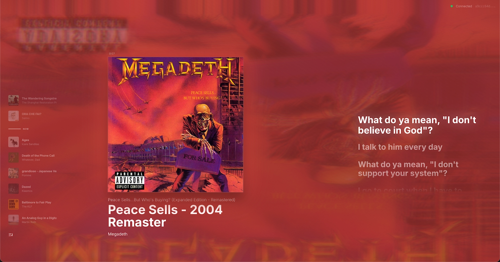

# SupaSession

> Because looking at Spotify wasn't extra enough.



A **completely unnecessary** but absolutely gorgeous way to display what you're listening to. Syncs your Spotify in real-time via WebSockets, wraps your album art in a dreamy blurred background, and throws lyrics on screen like it's a music video.

**Is it practical?** No.  
**Is it beautiful?** Absolutely.  
**Will you run it on a second monitor just to vibe?** You already know.

## Quick Start

```bash
# Install
pnpm install

# Run everything
pnpm dev

# Build the Spotify extension
pnpm build:extension
```

## Install the Spicetify Extension

```bash
cp extension/dist/supasession-messenger.js ~/.config/spicetify/Extensions/
spicetify config extensions supasession-messenger.js
spicetify apply
```

Click the green badge in Spotify → Copy session ID → Open `localhost:3000?session=<id>` → Vibe.

Or just open the web app and it auto-joins if you only have one session.

## How It Works

```
Spotify → [Spicetify Extension] → WebSocket Relay → React Web App
```

That's it. Three pieces. One vibe.

## Tech

React • Motion • Zustand • TailwindCSS • WebSockets • Unnecessary amounts of blur

---

*Built for fun. Maintained for vibes.*
